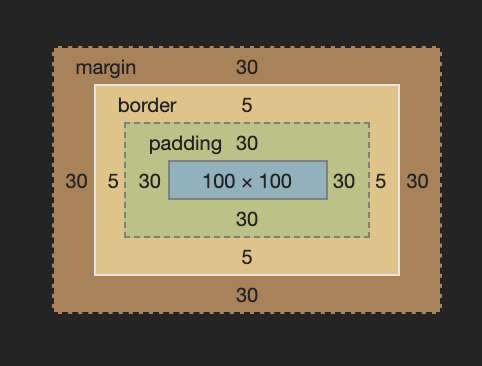
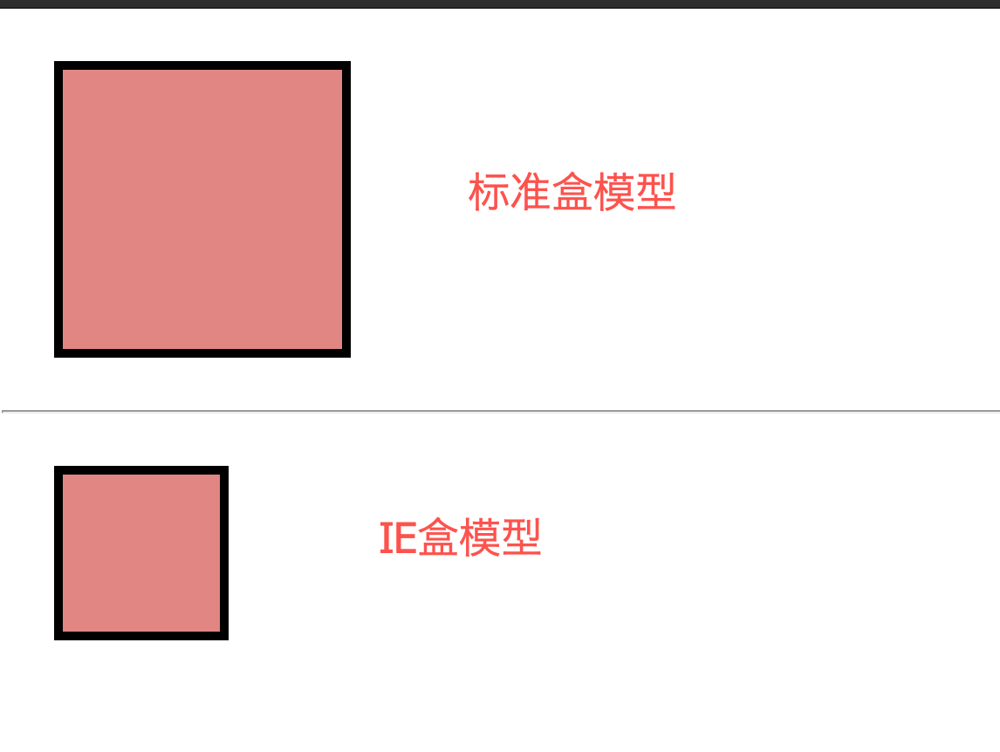
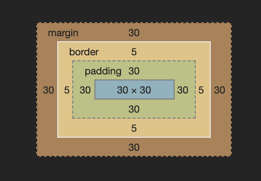
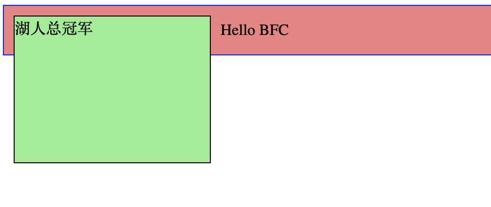
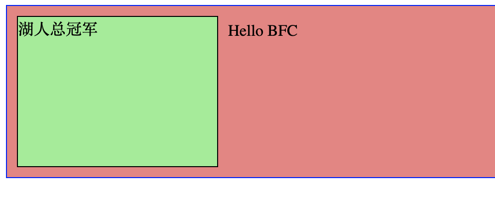
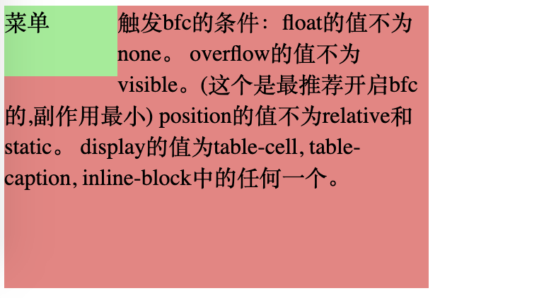

# 盒模型


## 块级盒子和内联盒子

在CSS中，所有的元素都被一个个的“盒子”包围着。这些盒子可以分为两大类，一个是块级盒子，一个是内联盒子，它们的呈现方式是不同的。

### 块级盒子

一个被定义为块级的盒子有着如下的表现形式：

- 块级盒子会在内联方向上扩展并且占据父容器在该方向上的所有可用空间，换句话说，在绝大多数情况下，块级盒子会和父容器一样宽
- 每个盒子都会换行
- `height`和`width`属性会生效
- `padding`, `margin`, `border` 会将其他元素从当前盒子周围“推开”

### 内联盒子

一个行内（inline）的盒子的表现形式如下：
- 不会换行
- `height`与`width`不起作用
- `padding`, `margin`, `border` 会被应用但是不会把其他处于`inline`状态的盒子推开

## 什么是盒模型

盒模型定义了盒子的每个部分：`content`，`padding`，`border`，`margin`，它们合在一起就创建了我们页面上的各个元素。完整的 CSS 盒模型应用于块级盒子，内联盒子只使用盒模型中定义的部分内容。

我们来看看这四个部分：

1. `content box`
这个表示元素的显示内容，可以通过`width`和`height`来指定元素的宽高。
2. `padding box`
这个表示元素的内边距，它是内容区外面的空白区域，可以通过`padding`来设置。
3. `border box`
边框盒子包裹着元素的内容盒子和内边距盒子，通过`border`可以设置其相关属性。
4. `margin box`
元素的外边距盒子，是盒子与其他元素之间的空白区域，通过`margin`指定。  

它们之间的关系如下图所示：


盒模型分为两类，一种是**标准模型**，也就是我们常见的那种展示形式；还有一种是**IE模型**（IE：是的，没错，又是我）。它们针对元素的计算方式是不同的。

### 标准盒模型

我们先从一个例子来看标准模型下的元素计算方式：

```html
<!DOCTYPE html>
<html lang="en">
<head>
  <meta charset="UTF-8">
  <meta name="viewport" content="width=device-width, initial-scale=1.0">
  <title>Box Model</title>
  <style>
    .box{
      height: 100px;
      width: 100px;
      border: 20px;
      margin: 30px;
      padding: 30px;
      border: 5px solid;
      background: lightcoral;
    }
    .standard-box{
      box-sizing: content-box;
    }
  </style>
</head>
<body>
  <div class="box standard-box">
  </div>
  <hr>
</body>
</html>
```

上面的一段代码很简单，定义了一个简单的div,并且设置了盒子相关的属性，这时候的`standard-box`盒子大小的计算方式为：
- 宽度 = `width` + `padding` + `border` = `100px` + `30px` * 2 + `5px` * 2 = **`170px`**
- 高度 = `height` + `padding` + `border` = `100px` + `30px` * 2 + `5px` * 2 = **`170px`**

我们来看看在 Chrome DevTool 的 Elements 面板中的呈现：



::: warning 注意
`margin` 不计入实际大小，它会影响盒子在页面所占空间，但是影响的是盒子外部空间。盒子的范围到边框为止，不会延伸到`margin`。
:::


### IE 盒模型

如果你觉得上面计算盒子大小的公式很麻烦，那么你可以使用另一种**替代盒模型**，也就是**IE盒模型**。使用这个模型的话，那么你定义的宽度就是元素的最终宽度，定义的高度就是元素的最终高度。我们在上面例子的基础上再增加一个IE盒模型的对比：
```html
<style>
.ie-box{
  box-sizing: border-box;
}
</style>
// ... 省略其他
<div class="box ie-box">
</div>
```

最终显示如图：



可以看到，选择IE模型的盒子变小了。我们再来看看Devtool面板上的计算结果：



可以看到，元素内容的实际大小只有`30 x 30`，这个数字是怎么来的呢？原来，在IE盒模型中，**元素的内容宽度是定义的宽度减去边框和填充部分**。也就是说，此时：

- 元素内容宽度 = `width` - `padding` - `border` = `100px` -  `30px` * 2 - `5px` * 2 = **30px**
- 元素内容高度 = `height` - `padding` - `border` = `100px` -  `30px` * 2 - `5px` * 2 = **30px**

我们定义的宽高，实际上是最终显示的盒子的宽高，而真正的元素内容的宽高，是需要减去内边距和边框的大小的。

**通过以上的例子，我们知道了标准盒模型和IE盒模型的区别。浏览器默认的会使用标准盒模型，即`box-sizing`的值为`content-box`，如果想切换成IE盒模型，可以指定`box-sizing`的值为`border-box`。**


## BFC

### 什么是BFC

提交盒模型，这里延伸一下，我们来说说`BFC`，它跟`KFC`没有半毛钱的关系。`BFC`，是`Block Formating Context`的缩写，翻译过来就是`块级格式化上下文`，看一下官方给它的解释：

`BFC`决定了元素如何对其内容进行定位，以及与其它元素的关系和相互作用。当涉及到可视化布局时，`BFC`提供了一个环境，`HTML`元素在这个环境中按照一定的规则排列布局。

我们可以这样通俗的理解称，其实`BFC`就是形成一个完全独立的空间，让空间中的子元素不会影响到外面的布局。可是如何形成这样一个空间呢？常见的触发条件有这样几种（更多的条件可以参考[MDN](https://developer.mozilla.org/zh-CN/docs/Web/Guide/CSS/Block_formatting_context)上的详细介绍，这里不一一列举）：

- 浮动元素（float不为none)
- 绝对定位元素（元素的 position 为 absolute 或 fixed）
- overflow 值不为 visible 的块元素
- display 的值为 `inline-block`、`table-cell`、`flow-root`

### BFC 解决了哪些问题

#### 浮动元素让父元素高度塌陷问题

我们先来看不使用BFC会出现的问题：

```html
<style>
.bfc-box {
  background-color: lightcoral;
  border: 1px solid blue;
}

.float {
  float: left;
  margin: 10px;
  width: 200px;
  height: 150px;
  border: 1px solid black;
  background-color: lightgreen;
}
</style>

<div class="bfc-box">
  <div class="float">湖人总冠军</div>
  <p>Hello BFC</p>
</div>
```

结果如图所示：


可以看到，绿色的部分已经超出了红色部分的高度。因为绿色浮动的子元素脱离了文档流，所以红色的父元素检测不到它的高度，所以只包含了p的内容，不包含浮动，所以高度没有被撑开，看上去就像是高度坍塌了。你可以给父元素添加条件，触发它的`BFC`，就可以解决了，这里我们添加如下：

```css {4}
.bfc-box {
  background-color: lightcoral;
  border: 1px solid blue;
  display: flow-root;
}
```

再来看看效果：



当然，我们使用其他的方式也是可以的，这里列举几种，仅供参考：
- 给父元素添加 `overflow: hidden;` 形成`BFC`
- 给父元素添加 `display: inline-block` 形成`BFC`
- 给父元素也添加浮动`float: left`，让它们一起脱离文档流
- 给父元素添加一个固定高度

### 文字环绕问题

如果我们要做一个两列布局的效果，你可能会这么写：

```html

<style>
.content{
  width: 300px;
  height: 200px;
  background: lightcoral;
}
.left{
  height: 50px;
  width: 80px;
  float: left;
  background: lightgreen;
}
</style>

<div class="content">
  <div class="left">菜单</div>
  <div class="right">
    触发bfc的条件：float的值不为none。
    overflow的值不为visible。(这个是最推荐开启bfc的,副作用最小)
    position的值不为relative和static。
    display的值为table-cell, table-caption, inline-block中的任何一个。
  </div>
</div>
```

效果：



我们让左侧的元素左浮动后，可以看出副作用了，即出现了文字环绕的效果，这显然不是我们希望看到的。我们希望左右两侧毫无关联，井水不犯河水，所以这里要给右侧元素来一个`BFC`：
```css
.right{
  overflow: hidden;
}
```
效果：


#### 外边距垂直方向塌陷问题

这应该是提及最多的问题，讲的是，兄弟元素在垂直方向上的外边距会求和，而不是取最大值。看个例子：

```html
<style>
.father p{
  height: 100px;
  width: 100px;
  background-color: lightcoral;
}
.son-1{
  margin-bottom: 100px;
}
.son-2{
  margin-top: 100px;
}
</style>

<div class="father">
  <p class="son-1"></p>
  <p class="son-2"></p>
</div>
```

看上去，我们的`son-1`和`son-2`之间的间隔应该是`100+100=200px`，但是实际上却不是这样：


我们这里在第二个子元素上创建一个`BFC`来解决问题：

```html
<div class="father">
  <p class="son-1"></p>
  <div style="overflow: hidden;">
    <p class="son-2"></p>
  </div>
</div>
```

效果：


### 参考资料

- [https://developer.mozilla.org/zh-CN/docs/Learn/CSS/Building_blocks/The_box_model](https://developer.mozilla.org/zh-CN/docs/Learn/CSS/Building_blocks/The_box_model)


