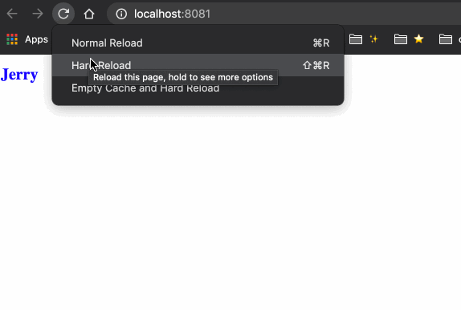

# 锦上添花的 Modules

## style

### 使用方式

关于 style 的使用方式：[snabbdom-module/style](https://github.com/snabbdom/snabbdom#the-style-module)


我们对上一节的栗子做一些小小的修改：

```js{5,7,12}
import { init } from 'snabbdom';
import h from 'snabbdom/h';
import style from 'snabbdom/modules/style'

const patch = init([style])

const vnode = h('h1', { style: { color: 'red' } }, 'Hello snabbdom')

patch(document.getElementById('container'), vnode)

setTimeout(() => {
  patch(vnode, h('h1', { style: { color: 'blue', fontSize: '20px' } }, 'Jerry'))
}, 3000);
```

运行结果：



### 源码解析


首先我们先对导入的 style 模块有个基本的认识，它位于 src/modules/style.ts 中：

```js
export const styleModule: Module = {
  pre: forceReflow,
  create: updateStyle,
  update: updateStyle,
  destroy: applyDestroyStyle,
  remove: applyRemoveStyle
};
```

可以看到，它实际上就是一个包含几个钩子函数的对象。

在上一节的 init 介绍过程中，我们提到了与模块相关的初始化，也就是在 init 的一开始：

```js
let i: number;
let j: number;

const cbs: ModuleHooks = {
  create: [],
  update: [],
  remove: [],
  destroy: [],
  pre: [],
  post: []
};

const api: DOMAPI = domApi !== undefined ? domApi : htmlDomApi;

for (i = 0; i < hooks.length; ++i) {
  cbs[hooks[i]] = [];
  for (j = 0; j < modules.length; ++j) {
    const hook = modules[j][hooks[i]];
    if (hook !== undefined) {
      (cbs[hooks[i]] as any[]).push(hook);
    }
  }
}
```

其中 hooks 的定义为：

```js
const hooks: Array<keyof Module> = ['create', 'update', 'remove', 'destroy', 'pre', 'post'];
```

所以，上面的两层循环执行完以后，我们的 cbs 的结果如下：

```js
{
  pre: [forceReflow],
  create: [updateStyle],
  update: [updateStyle],
  destroy: [applyDestroyStyle],
  remove: [applyRemoveStyle]
}
```

接着，snabbdom 会在合适的时机调用这些钩子，完成相应的功能。

#### pre 钩子

结合上一节的介绍，当第一次调用 patch 的时候，我们来分析一下执行逻辑，首先是 pre 钩子：

```js
for (i = 0; i < cbs.pre.length; ++i) cbs.pre[i]();
```

也就是会先执行我们的 `forceReflow` 方法：

```js
function forceReflow () {
  reflowForced = false;
}
```

很简单，就是重置这个 reflowForced 标记位为 false。关于这个标记位的作用，我们待会会讲到。

#### create 钩子

紧接着，由于是第一次调用，所以这时候执行的是 createElm 。在 `createElm(vnode, insertedVnodeQueue);` 中，我们会执行到：

```js
for (i = 0; i < cbs.create.length; ++i) cbs.create[i](emptyNode, vnode);
```

也就是会执行 updateStyle 方法：

```js
function updateStyle (oldVnode: VNode, vnode: VNode): void {
  var cur: any; // 循环时使用的变量
  var name: string; // 循环时使用的变量
  var elm = vnode.elm; // DOM 节点
  var oldStyle = (oldVnode.data as VNodeData).style; // 旧的 style
  var style = (vnode.data as VNodeData).style; // 新的 style

  if (!oldStyle && !style) return; // 都没有定义的话，直接 return
  if (oldStyle === style) return; // 相等的话，直接 return
  oldStyle = oldStyle || {};
  style = style || {};
  var oldHasDel = 'delayed' in oldStyle; // oldStyle 中是不是有 delayed 属性

  for (name in oldStyle) {
    if (!style[name]) {
      if (name[0] === '-' && name[1] === '-') {
        (elm as any).style.removeProperty(name);
      } else {
        (elm as any).style[name] = '';
      }
    }
  }
  for (name in style) {
    cur = style[name];
    if (name === 'delayed' && style.delayed) {
      for (const name2 in style.delayed) {
        cur = style.delayed[name2];
        if (!oldHasDel || cur !== (oldStyle.delayed as any)[name2]) {
          setNextFrame((elm as any).style, name2, cur);
        }
      }
    } else if (name !== 'remove' && cur !== oldStyle[name]) {
      if (name[0] === '-' && name[1] === '-') {
        (elm as any).style.setProperty(name, cur);
      } else {
        (elm as any).style[name] = cur;
      }
    }
  }
}
```

这里的 oldVnode 是一个空的 Vnode：emptyNode，它的值为 `vnode('', {}, [], undefined, undefined);`；vnode 则是刚刚创建的：`h('h1', { style: { color: 'red' } }, 'Hello snabbdom')`。代入这两个值，我们来看看这里的流程：

首先声明了一堆变量，接着进入第一个 for 循环：

```js
for (name in oldStyle) {
  if (!style[name]) {
    if (name[0] === '-' && name[1] === '-') {
      (elm as any).style.removeProperty(name);
    } else {
      (elm as any).style[name] = '';
    }
  }
}
```

很显然，这段逻辑的主要作用，是将 oldStyle 中有但是 style 中没有的样式或者样式属性删除。由于我们此时的 oldStyle 是个空对象，所以这段循环内的代码也不会被执行。


接着我们来看第二段循环：

```js
for (name in style) {
  cur = style[name];
  if (name === 'delayed' && style.delayed) {
    for (const name2 in style.delayed) {
      cur = style.delayed[name2];
      if (!oldHasDel || cur !== (oldStyle.delayed as any)[name2]) {
        setNextFrame((elm as any).style, name2, cur);
      }
    }
  } else if (name !== 'remove' && cur !== oldStyle[name]) {
    if (name[0] === '-' && name[1] === '-') {
      (elm as any).style.setProperty(name, cur);
    } else {
      (elm as any).style[name] = cur;
    }
  }
}
```

这里是遍历新的 style 对象，拿到每一个属性进行处理。首先判断属性的名称是不是 delayed，并且 style.delayed 有值，满足条件的话，再继续遍历这个 delayed 对象，再拿到它的每一个属性，如果 oldStyle 中没有 delayed 属性，或者当前属性的值与 oldStyle 中对应的属性的值不想等，那么执行：

```js
setNextFrame((elm as any).style, name2, cur);
```

这个 setNextFrame 实现也很简单，就是利用浏览器的异步机制将当前属性的赋值延迟到下一次事件循环中：

```js
var raf = (typeof window !== 'undefined' && (window.requestAnimationFrame).bind(window)) || setTimeout;
var nextFrame = function (fn: any) {
  raf(function () {
    raf(fn);
  });
};
var reflowForced = false;

function setNextFrame (obj: any, prop: string, val: any): void {
  nextFrame(function () {
    obj[prop] = val;
  });
}
```

由于我们这里没有 delayed 属性，所以这里执行的其实是第二个判断：

```js
else if (name !== 'remove' && cur !== oldStyle[name]) {
  if (name[0] === '-' && name[1] === '-') {
    (elm as any).style.setProperty(name, cur);
  } else {
    (elm as any).style[name] = cur;
  }
}
```

首先判断名称不是 remove，因为我们会对 remove 属性做特殊处理；并且这个属性 oldStyle 中没有，因为我们只操作新增的样式。满足条件的话，就进行具体的值的设置了，如果发现是样式属性的话（即 --bgColor 之类的），就调用 DOM api `setProperty` 设置这个属性和值；如果是正常的样式的话，就直接给这个样式赋值即可。对于我们的例子，应该是直接给样式赋值，也就是给这个新创建的 h1 元素的 style 属性添加一个 `color: red` 样式。

好了，此时 updateStyle 方法介绍完了，整个流程还是很简单的，就是根据对应的条件，删除一些旧样式，添加一些新样式。

#### destroyed 钩子

第一个 patch 函数的最后，我们从之前章节的介绍中了解到，还有插入新节点、移除旧节点的操作：

```js
if (parent !== null) {
  // 先根据老的节点的位置插入新的节点，再把老的删除
  api.insertBefore(parent, vnode.elm!, api.nextSibling(elm));
  removeVnodes(parent, [oldVnode], 0, 0);
}
```

我们主要看 removeVnodes 的操作，它会遍历要移除的 vnodes，然后调用模块的 destroyed 钩子：

```js
invokeDestroyHook(ch);
```

这个函数我们在 patch 这节也有过介绍，其实就是调用 vnode 的 destroy 钩子和模块的 destroy 钩子，我们来看一下这个 style 模块的 destroy 钩子函数：

```js
function applyDestroyStyle (vnode: VNode): void {
  var style: any;
  var name: string;
  var elm = vnode.elm;
  var s = (vnode.data as VNodeData).style;
  if (!s || !(style = s.destroy)) return;
  for (name in style) {
    (elm as any).style[name] = style[name];
  }
}
```

这段逻辑主要是，如果当前 vnode 没有定义 style，或者 style.destroy 的没有值的话，那么直接返回；否则遍历这个 destroy 对象，把这里面的属性赋值给当前元素的 style 的对应属性。由于我们栗子中的 vnode 没有 style，所以这里直接返回了。

#### remove 钩子

接着回到 removeVnodes 中，接下来会执行到：

```js
for (let i = 0; i < cbs.remove.length; ++i) cbs.remove[i](ch, rm);
```

来执行我们模块的 remove 钩子。**remove 钩子是要和 CSS Transitions 一起使用的，它会在我们删除元素时执行对应的过渡动画**。我们来看看 style 对应的钩子函数的定义：

```js
function applyRemoveStyle (vnode: VNode, rm: () => void): void {
  var s = (vnode.data as VNodeData).style;
  if (!s || !s.remove) {
    rm();
    return;
  }
  if (!reflowForced) {
    // eslint-disable-next-line @typescript-eslint/no-unused-expressions
    (vnode.elm as any).offsetLeft;
    reflowForced = true;
  }
  var name: string;
  var elm = vnode.elm;
  var i = 0;
  var compStyle: CSSStyleDeclaration;
  var style = s.remove;
  var amount = 0;
  var applied: string[] = [];
  for (name in style) {
    applied.push(name);
    (elm as any).style[name] = style[name];
  }
  compStyle = getComputedStyle(elm as Element);
  var props = (compStyle as any)['transition-property'].split(', ');
  for (; i < props.length; ++i) {
    if (applied.indexOf(props[i]) !== -1) amount++;
  }
  (elm as Element).addEventListener('transitionend', function (ev: TransitionEvent) {
    if (ev.target === elm) --amount;
    if (amount === 0) rm();
  });
}
```

首先这里的 rm 函数是通过 `createRmCb(ch.elm!, listeners)` 创建出来的。如果发现没有 style 或者 style 对象没有定义 remove 的话，那么直接执行这个 rm 函数后返回即可。

接着判断 reflowForced 这个变量的值，我们在 pre 钩子中已经将它的值设为 false 了，所以这里这里要强制的**回流**一次，方式很简单，就是或许一个 DOM 的   offsetLeft 的值，然后将 reflowForced 设置为 true。

然后获取 remove 属性的值，遍历这个对象，将每一个属性添加到 applied 数组中，又给这个 DOM 元素的 style 添加这个属性。

接着又调用 `getComputedStyle(elm)` 来获取当前元素的计算样式的值 compStyle，通过这个 compStyle 来获取它的 `transition-property` 属性数组，再遍历这个数组，检查里面的元素是不是在之前定义的 applied 数组中，在的话给 amount 自增。

最后就是给我们的 `transitionend` 添加监听事件，在动画结束的时候执行 rm() 函数。

这里的逻辑可能解释起来比较抽象，读者可以自己写一个栗子尝试一下，就明白了这里的流程了。

#### update 钩子
还剩一个 update 钩子函数。当我们在 setTimeout 中第二次调用 patch 的时候，会执行 patchVnode 函数，在这个函数中会执行我们的 update 钩子：

```js
if (vnode.data !== undefined) {
  for (let i = 0; i < cbs.update.length; ++i) cbs.update[i](oldVnode, vnode);
  vnode.data.hook?.update?.(oldVnode, vnode);
}
```

由于 create 和 update 钩子对应的都是 updateStyle 函数，所以这里的执行流程也是一样的，读者可以根据 create 自行理解一下这里的流程。

